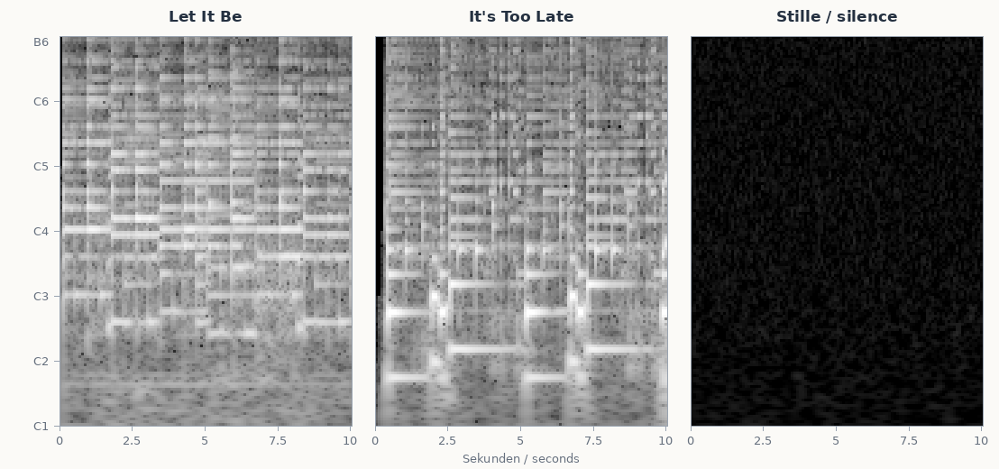
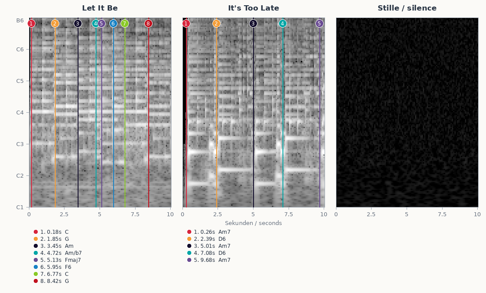
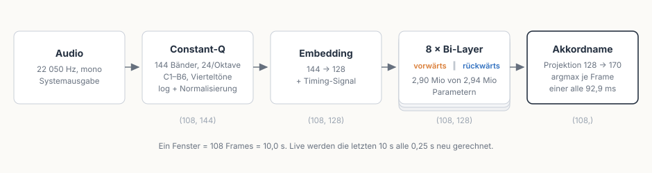

# Wie JamPilot Akkorde erkennt — und warum das nie 100 % sein kann

*English version: [HOW-IT-WORKS.md](HOW-IT-WORKS.md)*

JamPilot hört das Systemaudio mit, hält es ein paar Sekunden zurück und zeigt
die Akkorde an, **bevor** man sie hört ([README](README.md)). Dieses Dokument
erzählt, *wie* die Erkennung dahinter funktioniert: den klassischen
Chroma-Ansatz, mit dem das Projekt gestartet ist, warum wir auf ein gelerntes
Modell umgestiegen sind — und warum auch der beste Erkenner an eine
prinzipielle Grenze stößt, die nichts mit Fleiß zu tun hat.

Stand: 2026-08-30 (Schaubilder zum Modell ergänzt; die Messungen stammen vom
2026-08-08, nach dem Umbau auf das BTC-Modell). Alle Zahlen stammen aus
Messungen gegen handannotierte Referenzaufnahmen
([tests/reference/README.md](tests/reference/README.md)).

---

## 1. Der klassische Ansatz: Chroma + Schablonen

Die erste Fassung von JamPilot beantwortete die Frage „welcher Akkord klingt?"
rein mit Signalverarbeitung, in drei Schritten:

1. **Chroma berechnen.** Aus jedem 1,5-Sekunden-Fenster wird ein
   **12-Werte-Vektor** gewonnen — ein Eintrag je Tonklasse (C, C#, …, B), alle
   Oktaven zusammengefaltet. Vorher trennt eine harmonisch/perkussive
   Zerlegung (HPSS) das Schlagzeug heraus; eine Constant-Q-Transformation
   sorgt dafür, dass auch tiefe Grundtöne sauber getroffen werden
   ([chroma.py](jampilot/chroma.py)).
2. **Schablonen vergleichen.** Der Vektor wird per Cosinus-Ähnlichkeit gegen
   Akkord-Schablonen auf allen 12 Grundtönen gematcht — Dur, Moll, `7`,
   `maj7`, `m7` ([chords.py](jampilot/chords.py)). Der beste Treffer gewinnt;
   unter einer Mindestähnlichkeit gilt „kein Akkord".
3. **Absichern.** Ein Tonart-Prior ordnet knappe Lesarten, ein
   Mehrheitsentscheid über drei Analysen glättet Flackern, und eine separate
   **Onset-Suche** im 23-ms-Frameraster bestimmt, *wann* der Wechsel wirklich
   einsetzt — nicht wann die Erkennung ihn bemerkt hat.

Dazu kommt eine Idee, die JamPilot bis heute trägt: **zwei Fragen, zwei
Signale.** Welcher Akkord klingt, entscheidet die volle Harmonie; welche Note
*unten* liegt, wird separat im Tiefband gemessen ([bass.py](jampilot/bass.py)).
Nur so werden Umkehrungen sichtbar (`C/E`, `G/B`) — aus dem Akkordnamen allein
kann man sie nicht erraten.

**Die Stärken dieses Ansatzes** sind real und waren der Grund, so zu starten:
Er ist vollständig transparent (jede Entscheidung lässt sich nachrechnen),
braucht keinerlei Trainingsdaten, ist billig genug für alte Hardware — und er
ist **stilneutral**: Eine Schablone kennt kein Genre, ihr ist egal, ob Jazz
oder Metal anliegt.

**Die Schwächen** haben wir über Monate an echten Aufnahmen dokumentiert, und
sie sitzen tiefer, als es zunächst aussah:

- **Obertöne erzeugen Phantom-Töne.** Der fünfte Oberton einer großen Terz
  landet genau auf dem maj7-Ton. Ergebnis: ein hartnäckiger **maj7-Bias** —
  ein schlichtes `D7` wird gern als `Dmaj7` gelabelt, für Mitspielende der
  ärgerlichste Fehlertyp (die Septime ist *falsch*, nicht nur ungenau).
- **Gesang liegt im selben Frequenzband wie der Akkord** und lässt sich —
  anders als der Bass — nicht per Frequenz heraustrennen. Jede Melodielinie
  schüttet Nicht-Akkordtöne ins Chroma.
- **Fünf Schablonen sind ein kleines Vokabular.** `sus`, `dim`, `6`, `m7b5`
  existierten schlicht nicht; das Signal wurde in die nächstliegende der fünf
  Formen gepresst.
- **Flackern.** In dichten Passagen kippte die Anzeige zwischen Lesarten
  (`Amaj7`/`A7`/`C#m`…), und jede dieser Schwächen brauchte ihren eigenen
  Gegen-Hack: Komplexitätsmargen, Prior, Glättung.

Der entscheidende Befund kam aus einem systematischen Experiment
([docs/exploration/lernbasiertes-chroma.md](docs/exploration/lernbasiertes-chroma.md)):
Wir haben bessere Chroma-Extraktoren gemessen (CENS, ein selbst gebautes
NNLS-Chroma nach Mauch). Ergebnis: CENS klar schlechter, NNLS half nur
punktuell — **weiter am Chroma zu frickeln lohnt nicht.** Das Einzige, was
den maj7-Bias wirklich an der Wurzel packte, waren *gelernte* Mechanismen.
Dieses Messergebnis ist der eigentliche Wendepunkt des Projekts.

## 2. Der Umstieg: ein gelerntes Modell als Label-Quelle

Seit dem Umbau beantwortet die Frage „welcher Akkord?" ein neuronales Netz:
**BTC** („Bi-directional Transformer for Chord Recognition", Park et al.,
ISMIR 2019) — ein kleiner bidirektionaler Transformer, trainiert auf
expertenannotierten Aufnahmen, mit einem Vokabular von **14 Qualitäten × 12
Grundtöne** (170 Klassen). Der Checkpoint ist nur 12 MB groß — 2,94 Millionen
Parameter in float32, und genau das steht auch in der Datei; wir haben ihn
nach reinem NumPy portiert ([btc.py](jampilot/btc.py)), es gibt also keine
PyTorch-Abhängigkeit.

Wichtig: Es ist **kein Komplettersatz, sondern ein Hybrid.** Das Modell
liefert die Labels — alles, was es *nicht* kann, macht weiter unsere eigene
Signalverarbeitung:

- **Slash-Bässe** kennt das BTC-Vokabular nicht (`G/B` wäre für das Modell nur
  `G`). Die Bassnote wird weiter im Tiefband **gemessen**, jetzt aus derselben
  CQT, die ohnehin fürs Modell anfällt.
- **Grenzen verfeinern:** Das Modell arbeitet auf einem 93-ms-Raster und setzt
  Grenzen tendenziell *hinter* den hörbaren Wechsel. `refine_boundary` zieht
  jede Grenze im 23-ms-Raster auf das Audio-Ereignis — die Onset-Idee des
  alten Pfads, in neuer Form.
- **Tonart** wird weiter selbst geschätzt (sie entscheidet nur noch über die
  Schreibweise: `C#` oder `Db`).

### Was das Modell sieht

Das Modell bekommt nie Audio zu sehen. Was bei ihm ankommt, ist ein Bild:
**144 Frequenzbänder × 108 Zeitschritte**, ein Float je Feld. Die drei unten
sind keine Zeichnung dieser Matrix, sondern die Matrix selbst, genau so, wie
`features_from_audio()` sie liefert, danach mit genau demselben globalen
Mittelwert und derselben Standardabweichung normalisiert wie vor der
Modellinferenz. Die ersten beiden Felder sind feste **echte** 10-s-Ausschnitte
aus den Referenzaufnahmen, die im Repository ohnehin unter `tests/reference`
liegen: `let_it_be.mp3` und `its_too_late.mp3`; das dritte ist digitale Stille
bei -90 dBFS. `docs/bilder/make-btc-images.py` baut die gesamte Grafik neu.

Zu lesen wie ein Spektrogramm: **Jede Zeile ist ein Frequenzband** — 144
Stück, gestapelt von C1 unten bis B6 oben — und jede Spalte ist einer der 108
Zeitschritte, von links nach rechts über die zehn Sekunden. Heller heißt mehr
Energie in diesem Band zu diesem Zeitpunkt. Ein Anschlag erscheint als helle
senkrechte Kante, ein gehaltener Ton als **waagerechter Streifen**, der nach
rechts leiser ausläuft — und bei einem Akkordwechsel springt das ganze
Streifenmuster auf neue Höhen, was sich an den Markern der annotierten Grafik
weiter unten gegen die Ground Truth prüfen lässt. Alle drei Felder teilen sich
**eine** Graustufenskala — sonst sähe die Stille aus wie Rauschen bei voller
Aussteuerung, und der Vergleich wäre eine Lüge.

Die Überschriften benennen also die Quelle des Ausschnitts, nicht die Antwort
des Modells. Die Grafik soll die Eingabetextur zeigen, die der Transformer
sieht, bevor er für jedes Frame ein Akkordlabel entscheidet.

Wer Bild und Harmonie direkter übereinanderlegen will, findet im Repository
auch eine annotierte Hilfsgrafik. Sie markiert für `Let It Be` die
Referenz-Akkordwechsel und für `It's Too Late` genau den breiteren Wechsel
`Am7 → D6 → Am7 → D6 → Am7`, den man in den ersten zehn Sekunden tatsächlich
sehen kann:

In diesen waagerechten Streifen sitzt auch die **Viertelton**-Auflösung: Bei
24 Bändern je Oktave liegen zwei benachbarte *Zeilen* 50 Cent auseinander, jeder Halbton
bekommt also zwei davon. Die Obertonreihe passt nämlich nicht ins
Zwölftonraster — das Siebenfache des Grundtons landet 31 Cent unter der
gleichstufigen kleinen Septime, das Elffache fast genau zwischen Quarte und
Tritonus. Mit halbtonbreiten Bändern würden diese Teiltöne in ihren Nachbarn
schmieren und dort wie Akkordtöne aussehen, die niemand gespielt hat. Das
feinere Raster bringt außerdem Toleranz: Eine Aufnahme mit A = 442 Hz oder
eine nach Gehör gestimmte Gitarre rutscht nicht aus ihren Bändern.

Von diesem Bild bis zum Akkordnamen passt der ganze Weg auf eine Zeile:

Das Fenster liegt fest bei 108 Frames. Offline wird die Datei in
nicht überlappende Blöcke zerlegt; live rechnet JamPilot alle 250 ms die
letzten zehn Sekunden neu, jeder Moment Musik wandert also rund vierzigmal
durch das Modell — jedes Mal an einer anderen Stelle im Fenster.

Innen ist jede der acht Schichten doppelt ausgeführt:

**Beide Richtungen sind getrennt gelernt**, mit eigenen Gewichten — dorthin
geht die Hälfte aller Parameter, und das ist es, was das „bi-direktional" im
Namen bedeutet. Es erklärt auch ein Verhalten, das man beim Mitspielen spürt:
Am jüngsten Rand des Fensters hat der Rückwärts-Block nichts zu lesen, dort
*ist* noch keine Zukunft. Diese Frames flackern, und deshalb warten Segmente
am Rand bis zum nächsten Hop, statt sofort veröffentlicht zu werden. Der
Vorlaufpuffer bezahlt diese Wartezeit.

Ein Detail zielt noch genauer auf Musik: Wo ein Transformer sonst eine breite
punktweise Feed-Forward-Schicht hat, stehen bei BTC **zwei Faltungen über je
drei Frames** — und sie verbreitern gar nicht (128 bleibt 128). Jede Schicht
mischt dadurch zusätzlich lokal in der Zeit, ganz unabhängig von der
Attention. Für ein Signal, in dem benachbarte Frames fast immer denselben
Akkord tragen, ist das die nützlichere Nachbarschaft.

### Was der Umstieg messbar gebracht hat

Gemessen gegen fünf sekundengenau handannotierte Referenzaufnahmen
(Isophonics-Annotationen: Beatles, Queen, Carole King — ~500 annotierte
Akkordwechsel), beide Pfade in ihrer echten Live-Konfiguration, dieselbe
Metrik ([tests/reference/README.md](tests/reference/README.md)):

| Dauergewichtete Trefferquote | Schablonen-Pfad | BTC-Pfad |
|---|---|---|
| Grundton richtig | 69,5 % | **82,8 %** |
| Grundton + Dur/Moll-Geschlecht | 62,8 % | **81,5 %** |
| volle Qualität (Septimen-Ebene) | 49,5 % | **76,8 %** |
| erkannte Segmente (Referenz: 508) | 764 | **588** |

Die Fehlerrate hat sich also je nach Ebene **halbiert bis mehr als halbiert**
— am deutlichsten genau dort, wo der alte Pfad strukturell schwach war: bei
den Qualitäten. Der maj7-Bias ist praktisch verschwunden (das Modell labelt
Dominanten als Dominanten), tonartfremde Ausreißer-Grundtöne ebenso, und die
Anzeige ist ruhiger geworden — der alte Pfad produzierte 50 % mehr Segmente
als die Referenz enthält, lauter kurzes Umspringen zwischen Lesarten.

**Beim Timing dagegen war der alte Pfad nie das Problem.** Beide Verfahren
treffen den annotierten Wechsel mit einem Medianfehler um ~130–150 ms; die
alte Onset-Suche war sogar etwas dichter dran, erkaufte das aber mit vielen
Phantom-Grenzen (nur 51 % ihrer Grenzen lagen an einem echten Wechsel, beim
BTC-Pfad 58 %). Der Gewinn des Umbaus liegt bei den **Labels**, nicht bei der
Zeit — für den Mitspiel-Fluss ist beides zusammen entscheidend: der richtige
Akkord, zur ungefähr richtigen Zeit, ohne Flackern.

### Der Preis

Ehrlichkeit gehört dazu: Der neue Pfad kostet spürbar mehr CPU (alle 250 ms
eine CQT über das 10-s-Fenster plus Transformer-Inferenz — auf einem alten
Laptop kann das an die Grenze gehen), und ein *gelerntes* Modell ist nicht
mehr stilneutral. Dazu gleich mehr.

## 3. Warum das nie 100 % sein kann

Wer die Tabelle oben liest, fragt zu Recht: Warum stehen da 83 % und nicht
99 %? Die Antwort ist nicht „das Modell ist noch nicht gut genug". Ein Teil
des Abstands ist prinzipiell — er verschwindet mit keinem noch so guten
Erkenner. Fünf Gründe, vom fundamentalsten zum praktischsten:

**1. Ein Akkord ist eine Deutung, kein Messwert.** `C6` und `Am7` bestehen
aus exakt denselben vier Tönen (C-E-G-A) — welcher von beiden „klingt",
entscheidet nicht das Signal, sondern der harmonische Kontext, und darüber
sind sich selbst zwei Musiker nicht immer einig. Dasselbe gilt für `add9`
gegen `sus2`, für Durchgangsharmonien, für die Frage, ob die Septime im
Klavier „zum Akkord gehört" oder nur eine Melodienote war. Auch unsere
Referenzannotationen sind eine *Interpretation* — die messbare Obergrenze
jedes Erkenners ist die Einigkeit menschlicher Experten, und die liegt nicht
bei 100 %.

**2. Die Physik legt Töne ins Signal, die niemand gegriffen hat.** Jede
gespielte Note bringt ihre Obertonreihe mit; der fünfte Oberton der Terz
*ist* der maj7-Ton. Umgekehrt fehlen Töne, die „zum Akkord gehören": Ein
verzerrter Powerchord enthält **keine Terz** — ob Dur oder Moll gemeint ist,
steht schlicht nicht im Signal. Jeder Erkenner muss dort raten; er kann nur
klug raten.

**3. Gesang und Melodie wohnen im selben Band.** Die Stimme lässt sich nicht
wie der Bass per Frequenz abtrennen. Jede Melodielinie streut Nicht-Akkordtöne
genau dorthin, wo die Harmonie gemessen wird — ein gelerntes Modell wird
darin robuster, aber die Überlagerung selbst bleibt.

**4. Ein Wechsel ist kein Zeitpunkt.** Der Bass kommt einen Tick vor der
Gitarre, der Anschlag verschmiert über Millisekunden, die Annotation selbst
trägt ±50 ms Unsicherheit. „Den" wahren Moment des Wechsels gibt es nur als
Konvention — deshalb messen wir Timing als Verteilung, nicht als
richtig/falsch.

**5. Ein gelerntes Modell kennt sein Trainingsterrain.** BTC ist auf Pop und
Rock der 60er bis 90er trainiert (Beatles, Queen, Carole King, UsPop-Korpus).
Auf produziertem Pop funktioniert es entsprechend stark — bei stilferner
Musik (Progressive Rock mit Drones, terzlosen Powerchords, quartigen
Voicings) kann es deutlich danebenliegen. Der alte Schablonen-Pfad war
stilblind; das Modell hat den Stil *gelernt*, mit allem, was dazugehört.
Und weil unsere Referenzaufnahmen aus demselben Korpus stammen, sind die
Zahlen oben **In-Domain-Zahlen**: Für Musik abseits dieses Stilraums liegt
die echte Genauigkeit darunter.

Ein letzter Punkt, der kein Mangel ist: **Ein Rest Unruhe ist gewollt.** Wo
die Harmonie objektiv mehrdeutig ist — grundtonlose Passagen, Vamps ohne
Terz — zeigt JamPilot lieber wechselnde plausible Lesarten als eine falsche
Gewissheit. Für Mitspielende ist das eine Improvisationshilfe: Alles, was da
angezeigt wird, *passt* zu dem, was klingt.

## 4. Wo es weitergeht

- **Rechenlast:** Der Fixkostenblock der Feature-Extraktion war librosas
  Filterbank, die bei jedem CQT-Aufruf neu gebaut wurde — memoisiert kostet
  die Extraktion je Hop 21 statt 70 ms, bitidentisch. Eine inkrementelle CQT
  (Frames über die Hops cachen) brächte weitere 21 → 12 ms, bleibt aber
  draußen: gleiche Features, aber ihr hop-stabiles Raster erzeugt im
  Live-Pfad ~7 % mehr Events — das wandernde Raster der Vollrechnung wirkt
  als Dither, den der Debounce nutzt.
- **Stilraum:** Für Musik außerhalb des Trainingsterrains ist zuerst ein
  ehrliches Hörprotokoll nötig (wo genau kippt es?), bevor an Lösungen zu
  denken ist.
- **Timing:** Beide Pfade streuen ~±150 ms um den Wechsel; enger geht es nur
  mit besserem Zeitraster, nicht mit besseren Labels.

Wer tiefer einsteigen will: Die Messmethodik steht in
[tests/reference/README.md](tests/reference/README.md), der ursprüngliche
Modell-Benchmark in
[tests/realaudio/REPORT_btc_benchmark.md](tests/realaudio/REPORT_btc_benchmark.md),
die Exploration, die zum Umstieg führte, in
[docs/exploration/lernbasiertes-chroma.md](docs/exploration/lernbasiertes-chroma.md).
