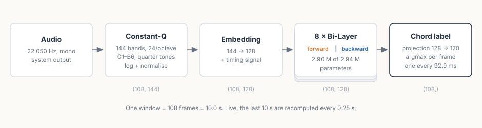

# How JamPilot recognises chords — and why it can never be 100 %

*Deutsche Fassung: [HOW-IT-WORKS.de.md](HOW-IT-WORKS.de.md)*

JamPilot listens to your system audio, holds it back for a few seconds and
shows the chords **before** you hear them ([README](README.md)). This document
tells the story behind the recognition: the classic chroma approach the
project started with, why we switched to a learned model — and why even the
best recogniser runs into a limit that has nothing to do with effort.

Last updated: 2026-08-30 (diagrams of the model added; the measurements are
from 2026-08-08, after the switch to the BTC model). All numbers come from
measurements against hand-annotated reference recordings
([tests/reference/README.md](tests/reference/README.md)).

---

## 1. The classic approach: chroma + templates

The first version of JamPilot answered the question "which chord is playing?"
with pure signal processing, in three steps:

1. **Compute a chroma.** Every 1.5-second window is reduced to a
   **12-value vector** — one entry per pitch class (C, C#, …, B), all octaves
   folded together. Before that, a harmonic/percussive separation (HPSS)
   strips out the drums; a constant-Q transform makes sure even low root
   notes are captured cleanly ([chroma.py](jampilot/chroma.py)).
2. **Match templates.** The vector is compared, by cosine similarity, against
   chord templates on all 12 roots — major, minor, `7`, `maj7`, `m7`
   ([chords.py](jampilot/chords.py)). The best match wins; below a minimum
   similarity the sound counts as "no chord".
3. **Stabilise.** A key prior settles close calls, a majority vote over three
   analyses smooths flicker, and a separate **onset search** on a 23 ms frame
   grid determines *when* the change actually happens — not when the
   recogniser noticed it.

On top of that sits an idea that carries JamPilot to this day: **two
questions, two signals.** Which chord is sounding is decided from the full
harmony; which note is *on the bottom* is measured separately in the low band
([bass.py](jampilot/bass.py)). That is the only way inversions become visible
(`C/E`, `G/B`) — you cannot guess them from the chord name.

**The strengths of this approach** are real, and they are why the project
started this way: it is fully transparent (every decision can be recomputed
by hand), needs no training data at all, is cheap enough for old hardware —
and it is **style-neutral**: a template has no notion of genre, it does not
care whether jazz or metal is playing.

**The weaknesses** we documented over months on real recordings, and they sit
deeper than they first appeared:

- **Overtones create phantom notes.** The fifth overtone of a major third
  lands exactly on the maj7 note. The result was a stubborn **maj7 bias** —
  a plain `D7` was happily labelled `Dmaj7`. For someone playing along, that
  is the most annoying kind of error: the seventh is *wrong*, not just
  imprecise.
- **Vocals live in the same frequency band as the chord** and — unlike the
  bass — cannot be separated out by frequency. Every melody line pours
  non-chord notes into the chroma.
- **Five templates are a small vocabulary.** `sus`, `dim`, `6`, `m7b5` simply
  did not exist; the signal was squeezed into the nearest of the five shapes.
- **Flicker.** In dense passages the display toggled between readings
  (`Amaj7`/`A7`/`C#m`…), and every one of these weaknesses needed its own
  counter-hack: complexity margins, the prior, smoothing.

The decisive finding came from a systematic experiment
([docs/exploration/lernbasiertes-chroma.md](docs/exploration/lernbasiertes-chroma.md)):
we measured better chroma extractors (CENS, a home-built NNLS chroma after
Mauch). Outcome: CENS clearly worse, NNLS helped only in places — **more
fiddling with the chroma does not pay.** The one thing that attacked the
maj7 bias at its root was a *learned* mechanism. That measurement is the
project's actual turning point.

## 2. The switch: a learned model as the label source

Since the rebuild, the question "which chord?" is answered by a neural
network: **BTC** ("Bi-directional Transformer for Chord Recognition", Park et
al., ISMIR 2019) — a small bidirectional transformer trained on
expert-annotated recordings, with a vocabulary of **14 qualities × 12 roots**
(170 classes). The checkpoint is only 12 MB — 2.94 million parameters in
float32, which is exactly what the file holds; we ported it to pure NumPy
([btc.py](jampilot/btc.py)), so there is no PyTorch dependency.

Importantly, it is **not a wholesale replacement but a hybrid.** The model
provides the labels — everything it *cannot* do is still done by our own
signal processing:

- **Slash basses** do not exist in the BTC vocabulary (`G/B` would just be
  `G` to the model). The bass note is still **measured** in the low band, now
  folded out of the same CQT that the model consumes anyway.
- **Boundary refinement:** the model works on a 93 ms grid and tends to place
  boundaries *behind* the audible change. `refine_boundary` pulls every
  boundary onto the audio event on a 23 ms grid — the onset idea of the old
  path, in a new form.
- **The key** is still estimated by us (it now only decides the spelling:
  `C#` versus `Db`).

### What the model actually sees

The model never touches audio. What reaches it is an image: **144 frequency
bands × 108 time steps**, one float per cell. The three below are not drawings
of that matrix but the matrix itself, exactly as `features_from_audio()`
returns it, then normalised with the same global mean and standard deviation
the model uses at inference time. The first two panels are fixed **real**
10-second excerpts from the reference recordings already shipped in
`tests/reference`: `let_it_be.mp3` and `its_too_late.mp3`; the third is
digital silence at -90 dBFS. `docs/bilder/make-btc-images.py` regenerates the
whole figure.

Read it like a spectrogram: **each row is one frequency band** — 144 of them,
stacked from C1 at the bottom to B6 at the top — and each column is one of the
108 time steps, running left to right over the ten seconds. Brighter means
more energy in that band at that moment. An attack shows up as a bright
vertical edge, a note held on as a **horizontal stripe** fading to the right —
and at a chord change the whole stripe pattern jumps to new heights, which the
markers in the annotated figure below let you check against the ground truth.
All three panels share **one** greyscale, otherwise the silence would look
like noise at full gain and the comparison would be a lie.

The headings identify the source clip, not the model's answer. The point of
the figure is the input texture the transformer receives before it decides
which chord label belongs to each frame.

If you want to line the picture up with harmony more directly, the repository
also ships an annotated helper figure. It marks the reference chord changes
for `Let It Be` and the broader `Am7 → D6 → Am7 → D6 → Am7` alternation that
you can indeed see in the first ten seconds of `It's Too Late`:

Those horizontal stripes are also where the **quarter-tone** resolution
lives: with 24 bands per octave, two neighbouring *rows* are 50 cents apart, so every
semitone gets two of them. The overtone series does not fit the twelve-tone
grid — seven times the fundamental lands 31 cents below the equal-tempered
minor seventh, eleven times it sits almost exactly between fourth and
tritone. With semitone-wide bands those partials would smear into their
neighbour and look like chord notes nobody played. The finer grid also buys
tolerance: a recording at A = 442 Hz, or a guitar tuned by ear, does not slide
out of its bands.

From that image to a chord name, the whole path fits on one line:

The window is fixed at 108 frames. Offline the file is cut into
non-overlapping blocks; live, JamPilot recomputes the last ten seconds every
250 ms, so every moment of music passes through the model around forty times,
each time at a different position in the window.

Inside, each of the eight layers is doubled:

**Both directions are learned separately**, with their own weights — that is
where half the parameters go, and it is what the "bi-directional" in the name
means. It also explains a behaviour you can feel while playing: at the
youngest edge of the window the backward block has nothing to read, because
there is no future there yet. Those frames flicker, which is why segments at
the edge wait for the next hop instead of being published straight away. The
lookahead buffer pays for that wait.

One more detail is aimed squarely at music: where a transformer normally has
a wide point-wise feed-forward layer, BTC has **two convolutions over three
frames each** — and they do not widen at all (128 stays 128). Every layer
therefore also mixes locally in time, quite apart from the attention. For a
signal in which neighbouring frames almost always carry the same chord, that
is the more useful neighbourhood.

### What the switch measurably bought

Measured against five reference recordings with hand-annotated, second-exact
ground truth (Isophonics annotations: Beatles, Queen, Carole King — about
500 annotated chord changes), both paths in their real live configuration,
same metric ([tests/reference/README.md](tests/reference/README.md)):

| duration-weighted accuracy | template path | BTC path |
|---|---|---|
| root correct | 69.5 % | **82.8 %** |
| root + major/minor quality | 62.8 % | **81.5 %** |
| full quality (sevenths level) | 49.5 % | **76.8 %** |
| detected segments (reference: 508) | 764 | **588** |

Depending on the level, the error rate was **cut in half or better** — most
clearly exactly where the old path was structurally weak: the qualities. The
maj7 bias is practically gone (the model labels dominants as dominants),
out-of-key outlier roots likewise, and the display has become calmer — the
old path produced 50 % more segments than the reference contains, all of it
short toggling between readings.

**Timing, on the other hand, was never the old path's problem.** Both methods
hit the annotated change with a median error around 130–150 ms; the old onset
search was actually a little closer, but paid for it with many phantom
boundaries (only 51 % of its boundaries sat at a real change, versus 58 % for
the BTC path). The gain of the rebuild is in the **labels**, not in time —
and for the flow of playing along, both matter together: the right chord, at
roughly the right time, without flicker.

### The price

Honesty is part of the story: the new path costs noticeably more CPU (every
250 ms a CQT over the 10-second window plus a transformer inference — an old
laptop can hit its limit), and a *learned* model is no longer style-neutral.
More on that in a moment.

## 3. Why it can never be 100 %

Anyone reading the table above will rightly ask: why does it say 83 % and not
99 %? The answer is not "the model is not good enough yet". Part of the gap
is fundamental — it does not go away with any recogniser, however good. Five
reasons, from the most fundamental to the most practical:

**1. A chord is an interpretation, not a measurement.** `C6` and `Am7`
consist of exactly the same four notes (C-E-G-A) — which of the two is
"sounding" is decided not by the signal but by the harmonic context, and even
two musicians do not always agree on it. The same goes for `add9` versus
`sus2`, for passing harmonies, for the question whether the seventh in the
piano "belongs to the chord" or was just a melody note. Our reference
annotations are an *interpretation* too — the measurable ceiling for any
recogniser is the agreement among human experts, and that is not 100 %.

**2. Physics puts notes into the signal that nobody played.** Every note
brings its overtone series; the fifth overtone of the third *is* the maj7
note. Conversely, notes that "belong to the chord" can be missing: a
distorted power chord contains **no third** — whether major or minor is meant
is simply not in the signal. Any recogniser has to guess there; it can only
guess cleverly.

**3. Vocals and melody live in the same band.** The voice cannot be split off
by frequency the way the bass can. Every melody line scatters non-chord notes
exactly where the harmony is being measured — a learned model gets more
robust to this, but the overlap itself remains.

**4. A change is not a point in time.** The bass arrives a moment before the
guitar, the attack smears over milliseconds, the annotation itself carries
±50 ms of uncertainty. "The" true moment of the change exists only as a
convention — which is why we measure timing as a distribution, not as
right/wrong.

**5. A learned model knows its training terrain.** BTC is trained on pop and
rock of the 60s to 90s (Beatles, Queen, Carole King, the UsPop corpus). On
produced pop it is correspondingly strong — on music far from that style
(progressive rock with drones, third-less power chords, quartal voicings) it
can miss badly. The old template path was style-blind; the model has
*learned* a style, with everything that entails. And because our reference
recordings come from the same corpus, the numbers above are **in-domain
numbers**: for music outside that stylistic space, real accuracy is lower.

One last point that is not a defect: **a residue of restlessness is
intentional.** Where the harmony is objectively ambiguous — rootless
passages, vamps without a third — JamPilot prefers showing alternating
plausible readings over a false certainty. For someone playing along, that is
an improvisation aid: everything shown there *fits* what is sounding.

## 4. Where it goes from here

- **Compute load:** the fixed cost of feature extraction was librosa's
  filterbank, rebuilt on every CQT call — memoised, extraction costs 21 ms
  per hop instead of 70, bit-identical. An incremental CQT (caching frames
  across hops) would bring a further 21 → 12 ms but stays out: same
  features, yet its hop-stable grid produces ~7 % more events in the live
  path — the wandering grid of the full recomputation acts as a dither the
  debounce relies on.
- **Stylistic reach:** for music outside the training terrain, the first step
  is an honest listening protocol (where exactly does it tip over?) before
  thinking about solutions.
- **Timing:** both paths scatter about ±150 ms around the change; getting
  tighter takes a finer time grid, not better labels.

For a deeper dive: the measurement methodology is in
[tests/reference/README.md](tests/reference/README.md), the original model
benchmark in
[tests/realaudio/REPORT_btc_benchmark.md](tests/realaudio/REPORT_btc_benchmark.md),
and the exploration that led to the switch in
[docs/exploration/lernbasiertes-chroma.md](docs/exploration/lernbasiertes-chroma.md).
