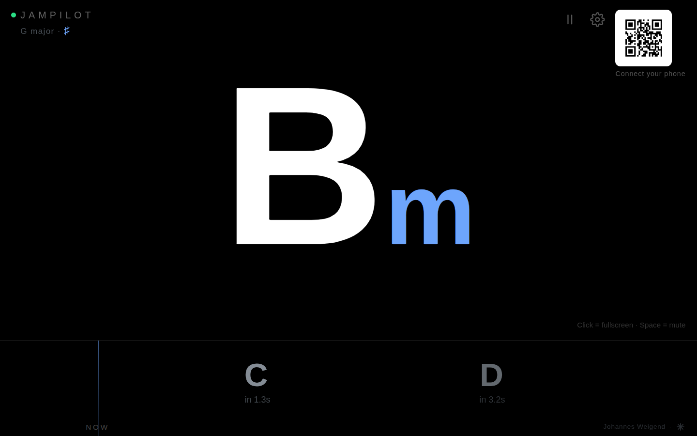
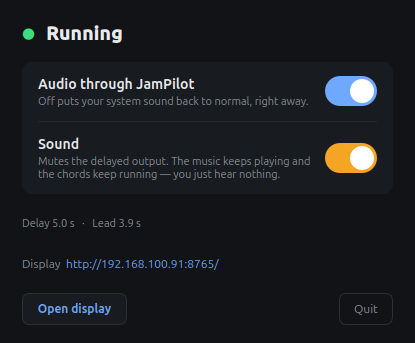
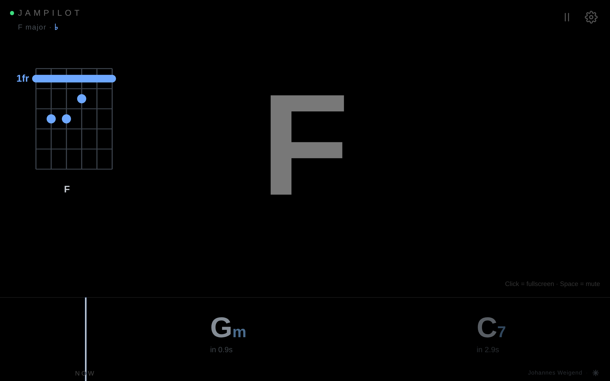

# JamPilot — jam along with anything, in real time

**Play any song on your computer. JamPilot shows you — and your whole band —
the chords, seconds before you hear them.**

[**▶ Watch the 60-second demo**](https://www.youtube.com/watch?v=zSepTG2ZgY0) ·
[Quick teaser (Short)](https://www.youtube.com/shorts/y1gzAMFe7cQ)


**Ever wanted to just grab your instrument and play along with whatever is coming
out of your computer?** Spotify, YouTube, the MP3s on your disk — the live take
nobody ever wrote a chord sheet for, the B-side that no tutorial will ever cover.
Not "look it up, learn it, come back next week". *Now.*

That is the whole idea. Whatever plays on your machine, JamPilot listens to it
and **shows you the chords while it runs** — and it shows them **before you hear
them**, so you are never a beat behind. Practise, learn a tune, or just play
along for the fun of it.

**No more googling for chords.** No transcription, no tutorial, no waiting a
week. Press play, and play.

**How, in one paragraph:** JamPilot taps your system audio, holds it back for a
few seconds, and plays it to your speakers **delayed but otherwise untouched**.
What it *analyses*, though, is the fresh signal — the part you have not heard
yet. So the chord is on your screen **seconds before it reaches your ears**.

```
System audio ──► ring buffer (N s) ──► speakers (delayed, unchanged)
      │
      └──► chord analysis ──► chord display (N s of lead)
```

You stop chasing the song. You see what is coming and play it.



*The chord you hear right now is the big one — `Bm`. `C` arrives in 1.3 seconds,
`D` in 3.2 — enough time to get your hand there. Top left, the key JamPilot has
worked out (G major); top right, a QR code to put the same display on your phone.*

The delay is not a defect to be minimised. **It is the feature**: it buys the
analysis a few seconds of the future, and it buys the player time to react. Four
seconds is a good default — long enough to see a change coming, short enough that
you still feel like you are playing *with* the record.

Written entirely in Python and platform-independent — fully tested on Linux, also
running on macOS and Windows ([see the table](#platforms)). It all happens on
your own machine — no account, no cloud, nothing uploaded anywhere. Open source,
MIT-licensed.

## Who is this for?

- **Guitarists, bassists and keyboard players** who want to play along with a
  song *now* — with a fretboard or piano diagram, not just a chord name.
- **Bands and rehearsal rooms**: one computer listens, everyone scans the QR
  code, and every phone and tablet in the room shows the same synced display —
  each set to its own instrument.
- **Learners and teachers** who want to see harmony happen in real time —
  including the detected key and the measured bass note (`C/E`).
- **Tinkerers** who want a music tool that is fully local, scriptable and open.

Two things worth knowing before you start, because you would find them out anyway:

- **You hear the song a few seconds late.** That is not a glitch, it is the deal:
  those seconds are what the analysis spends on the part you have not heard yet,
  and they are what gets the chord onto your screen *before* your ears get the
  music. The price is that JamPilot is for playing along with your machine — not
  for jamming with someone else in the room, and not for staying in sync with a
  video you are also watching.
- **Chords, not tabs.** JamPilot names the harmony — `Bm`, `C`, `D`, and the bass
  note under it if you want (`C/E`). It does not give you riffs, fingerings or
  solos. It hears a full working vocabulary — triads, sevenths, `sus`, `dim`,
  `aug`, `6` — with pop, rock, blues, folk as its home turf. Extensions beyond
  the seventh (`9`, `13`, altered notes) are folded into their core chord, so on
  a Real Book standard it will simplify what it hears. Why recognition works the
  way it does — and why it can never be 100 % — is the story of
  [HOW-IT-WORKS.md](HOW-IT-WORKS.md).

## What you see

**The display in the browser** is where you play. It opens by itself at
`http://<your-machine>:8765/` and is built to be read from across the room, in a
glance, while both your hands are busy:

- **The big chord in the centre** is what is sounding **right now**, in sync with
  what your speakers are putting out — not what the analysis is chewing on.
- **The lane at the bottom** is the future, moving right to left towards the
  `NOW` line. Each chord carries its countdown (`in 1.3s`). A chord flips to the
  centre in exactly the frame in which its chip touches the line — big chord and
  lane run off the same clock, so they cannot drift apart.
- **The key badge**, top left, once there is enough music to be sure of it.
- **The QR code** — scan it with a phone on the same Wi-Fi and you get the same
  display on your music stand. The computer does the listening; every other
  device is just a screen.
- Click or tap for fullscreen, `Space` to mute. The **gear** switches spelling
  (♯/♭) and the instrument mode (chords, bass, guitar or keyboard) — both are
  per-device, so your phone and your laptop may disagree.

**The control window** opens next to it — a small native window, and it is the
**way back**:



JamPilot reroutes your system sound while it runs. So the big switch at the top,
**Audio through JamPilot**, is the panic button — off, and your system sound is
normal again, immediately. Below it, **Sound** mutes only the delayed output,
and underneath you see the state, the delay, and the **lead actually being
measured** — 3.9 seconds in the shot above, which is how far ahead of your ears
the display is running. Closing the window quits JamPilot, and that restores
your audio.

## Your instrument: chords, bass, guitar or keyboard

The chord says what the **band** plays. It does not say what a **bass player**
plays: in C/E the chord is C, and the bass sits on E. That difference is not in
the chord name — so JamPilot **measures** the bass rather than deriving it from
the chord. The gear menu switches the display:

| Mode | Large on screen | Lane |
|---|---|---|
| **Chords** (default) | the audible chord | `C` |
| **Bass** | the **measured bass note**, chord as context | `C/E` |
| **Guitar** | the audible chord, with a **fretboard diagram** top-left | `C` |
| **Keyboard** | the audible chord, with a **piano diagram** top-left | `C` |



*Guitar mode: `F` is sounding — its barre-chord shape at the 1st fret is drawn
top-left — while `Gm` and `C7` approach in the lane.*

In **Guitar** mode the display adds the one thing a chord name leaves out:
*where* to put your hand. And because the same harmony lives in several
positions on the neck, the voicing is chosen **with the lead**: a look-ahead
over the coming chords picks the path with the least hand travel, so you keep
playing in one position instead of jumping across the neck. **Keyboard** mode
draws the same idea on two octaves of piano keys, choosing the *inversion* that
keeps your right hand in place, with the measured bass marked as the left hand.

When the audio cannot reliably decide between two readings — A major or A
minor? — the diagram is deliberately conservative: it shows a playable A5 shape
and mutes the uncertain third instead of asking you to guess. How the voicings
and the safe shapes work is in [UNDER-THE-HOOD.md](UNDER-THE-HOOD.md) and
[`docs/gitarrenmodus.md`](docs/gitarrenmodus.md).

**Spelling — ♯ or ♭:** JamPilot detects the key and spells every chord to match
(in F major you get B♭, not A♯). The gear menu can also force sharps or flats,
per device.

## Get it running

One script, straight from a fresh clone — Linux and macOS:

```bash
git clone https://github.com/jweigend/JamPilot.git && cd JamPilot
./run.sh                     # sets everything up on the first call, then starts
```

The first call takes about a minute (it builds the environment); every call
after that starts in under a second — and the script repairs a broken or
outdated environment by itself instead of failing at you.

```bash
./run.sh --delay 6           # any option of `jampilot run`
./run.sh selftest            # any other command: devices, analyze, cleanup ...
./run.sh --bundle            # standalone binary + double-click launcher -> dist/
```

On **Windows**:

```bat
git clone https://github.com/jweigend/JamPilot.git
cd JamPilot
run.cmd                      :: sets everything up on the first call, then starts
```

Use `run.cmd`, not `run.ps1` directly — it gets past the default PowerShell
execution policy for that one call without changing your system.

`run` options: `--delay` (seconds), `--output` (target sink/device), `--input` +
`--no-route` (direct mode without automatic routing), `--samplerate` (default
48000), `--port` (web display, default 8765), `--no-web`, `--no-window`.

Then just play something — a YouTube video, Spotify, anything that makes sound —
and watch the chords arrive before it does.

The one thing the script cannot install for you is **PortAudio**, because it is
a system library (`sudo apt install libportaudio2`, `brew install portaudio`).
It checks for it and says so. On Windows there is nothing to install at all.

### Platforms

JamPilot is written **entirely in Python and is platform-independent**: the
capture, the delay buffer, the chord analysis, the control window and the web
display are the *same* code everywhere. The only part that differs per operating
system is how the system sound is tapped silently.

| Platform | Status | Notes |
|---|---|---|
| **Linux** | ✅ Fully tested | The reference platform. Automatic null-sink routing via PipeWire/PulseAudio (`pactl`). |
| **macOS** | 🟡 Developed, incompletely tested | Runs via [BlackHole](https://existential.audio/blackhole/) as the loopback driver, devices picked by hand (`--no-route --input`). |
| **Windows** | 🟡 Running, incompletely tested | Automatic routing, and in the common case **nothing to install**. Verified on Windows 10. |

**How the routing works:** JamPilot temporarily puts a silent detour in front of
your default output, reads the fresh signal there, and sends only the delayed
music to your real speakers. On exit — including a crash — everything is
restored; `jampilot cleanup` handles even a hard kill. The full story
(transactional setup, the driver-free Windows route, the probe tone) is in
[UNDER-THE-HOOD.md](UNDER-THE-HOOD.md).

### macOS

Install [BlackHole (2ch)](https://existential.audio/blackhole/), then:

- set the system output to "BlackHole 2ch",
- `jampilot run --no-route --input "BlackHole 2ch" --output "MacBook Pro Speakers"`.

`jampilot devices` lists the device names.

### Windows

`run.cmd` is the whole setup. You keep listening on your normal speakers;
JamPilot only needs a **second output endpoint** to use as the silent detour —
an HDMI or DisplayPort output counts even with nothing but a monitor on it, and
so does an empty S/PDIF jack. `run.cmd devices` prints what the automatic mode
will pick. If your machine really has only one output, install
[VB-CABLE](https://vb-audio.com/Cable/) once (as administrator, reboot) and
JamPilot uses it automatically.

Worth knowing:

- **Voice chat is left alone.** Teams, Discord and Zoom keep their own device
  and stay undelayed — Windows' *Communications* device is never touched.
- **Your audio comes back** — on exit, on Ctrl+C, on closing the console. After
  a hard kill, the next start (or `run.cmd cleanup`) restores it.
- **The firewall dialog on first start is real**: the web display listens on
  the network. Allow it for private networks, or the QR code is useless.
- Apps in WASAPI *exclusive mode* (some DAWs) bypass the tap; `--route cable`
  captures them.

More depth — per-app routing, the undocumented API for the default device, what
exactly has been verified — in [UNDER-THE-HOOD.md](UNDER-THE-HOOD.md).

## Standalone binary

A single executable, no Python and no venv on the target machine:

```bash
./run.sh --bundle          # -> dist/jampilot + dist/JamPilot.desktop  (~183 MB)
```

On Linux, double-click `dist/JamPilot.desktop` (not the raw binary), or put it
in the menu with `./dist/jampilot install`. The build is reproducible and only
rebuilds when sources changed — details in [UNDER-THE-HOOD.md](UNDER-THE-HOOD.md).

## Current limitations

Honesty section — the things JamPilot does *not* do (yet):

- **Not for jamming with other people in the room.** Everyone would hear the
  original *and* play to a display that runs seconds behind it. JamPilot is for
  playing along with what your computer plays.
- **Chords, not melody or tabs.** No riffs, no solos, no rhythm notation.
- **Complex jazz harmony gets simplified.** Extensions beyond the seventh are
  folded into their core chord ([why](HOW-IT-WORKS.md)).
- **Recognition is very good, not perfect** — pop, rock, blues and folk are its
  home turf; dense or unusual material degrades gracefully rather than failing
  loudly ([the numbers](HOW-IT-WORKS.md)).
- **macOS routing is still manual** (BlackHole + two flags), and macOS/Windows
  have not had long musical sessions yet — see the platform table.
- **One computer is the listener.** Phones and tablets are displays, not
  microphones.

## How it works

The short version: system audio → ring buffer (played back delayed, otherwise
untouched) → a learned chord recogniser (BTC, a bidirectional transformer,
ported to pure NumPy — no PyTorch) labels the fresh signal every 250 ms → a
separately **measured** bass line makes inversions visible → boundaries are
pulled onto the audible attack → the browser renders it all off one shared
clock, so nothing drifts.

- **The concept and the recognition** — including why it can never be 100 %,
  with measurements: [HOW-IT-WORKS.md](HOW-IT-WORKS.md)
  (auch [auf Deutsch](HOW-IT-WORKS.de.md))
- **The engineering** — audio routing, timing, packaging, and the failed
  attempts that shaped the design: [UNDER-THE-HOOD.md](UNDER-THE-HOOD.md)

## Tests

```bash
./run.sh selftest                 # the pipeline, no sound card needed
.venv/bin/python -m pytest        # the suite (419 tests)
```

## Roadmap

- More controls in the web display: lead slider, on/off, device selection (right
  now only the spelling lives there; the rest of the control is in the CLI).
- An incremental CQT in the live path — the 10 s analysis window is currently
  recomputed from scratch every 250 ms, and that is the biggest lever for old
  hardware.
- An honest look at music outside the model's training terrain (see
  [HOW-IT-WORKS.md](HOW-IT-WORKS.md) on why a learned recogniser has a home
  style).
- Turn the last stage from a chord *detector* into a **harmonic interpreter** —
  one that decides from key, bass, chord history, metre and genre which chord is
  most *useful to the player*, and that uses the lead to revise its own display
  before anyone has seen it. See
  [`docs/exploration/harmonischer-interpreter.md`](docs/exploration/harmonischer-interpreter.md).
- macOS convenience: automatic BlackHole device detection.

## Feedback & contributing

JamPilot is young and built to be played with. If you rehearse regularly, your
feedback is worth more than a star: What would make this useful in *your*
practice room? Which instruments or views are missing?

- **Bug reports and ideas** → [Issues](https://github.com/jweigend/JamPilot/issues)
- **Questions and show-and-tell** → [Discussions](https://github.com/jweigend/JamPilot/discussions)
- **Code** → [CONTRIBUTING.md](CONTRIBUTING.md)

## License

[MIT](LICENSE). The chord recogniser is a NumPy port of the
[BTC model](https://github.com/jayg996/BTC-ISMIR19) (Park et al., ISMIR 2019),
which is also MIT-licensed.
