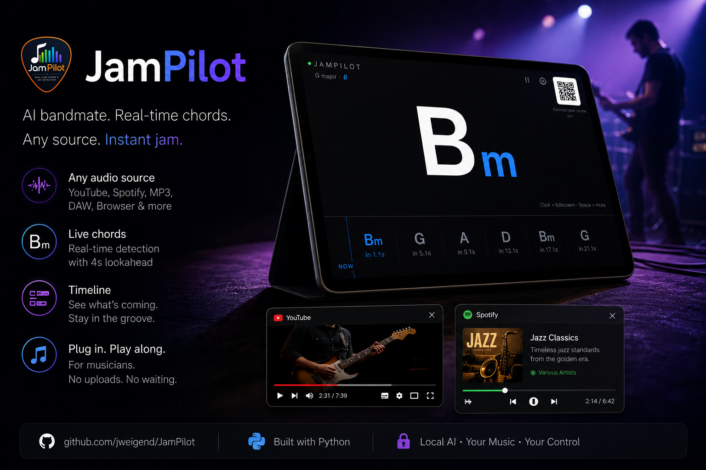
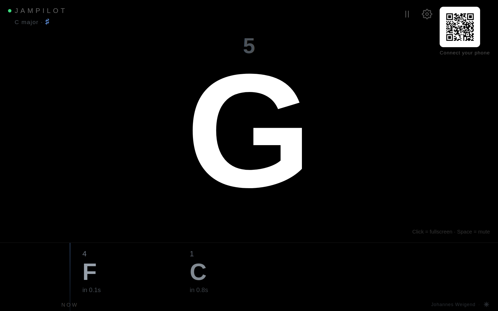
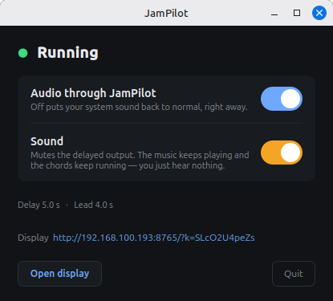
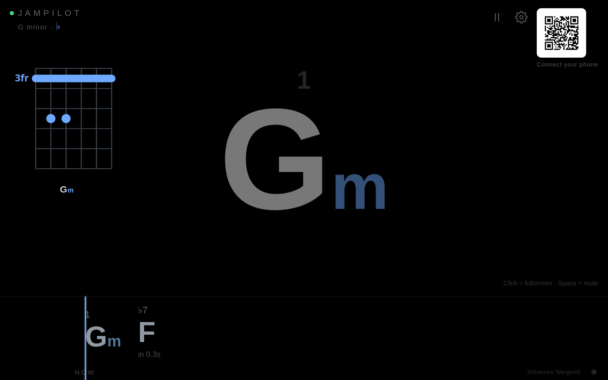
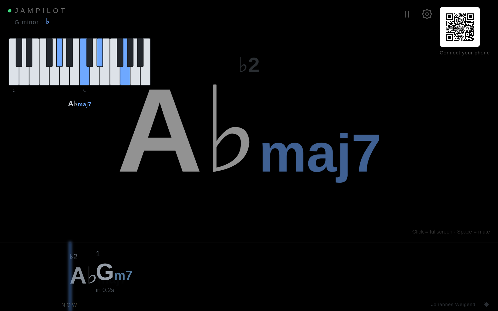
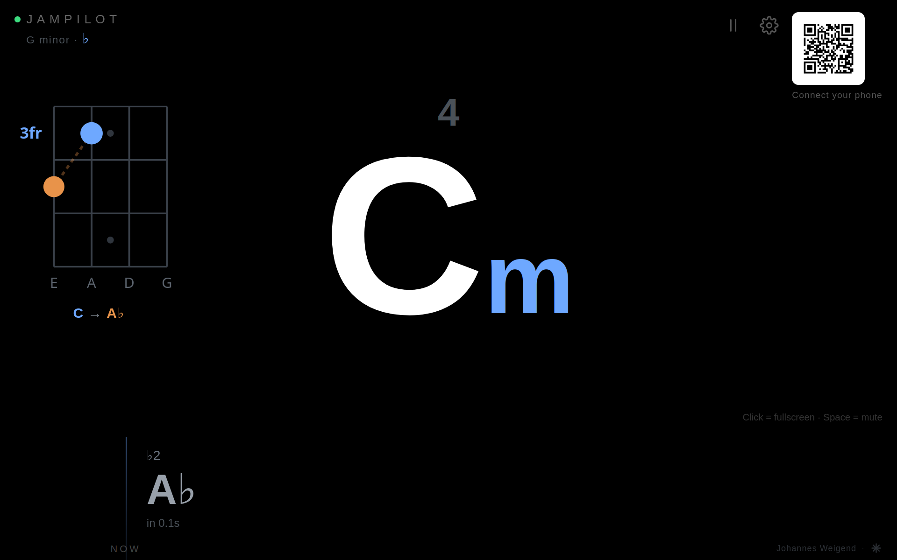
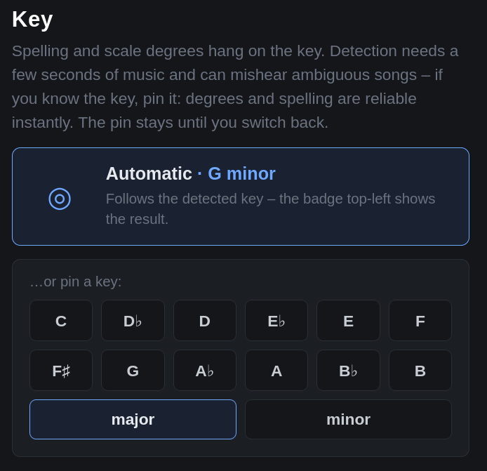
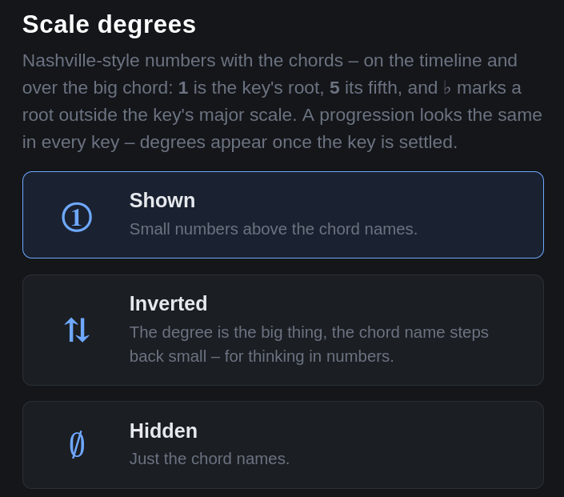

#  JamPilot — jam along with anything, in real time

**Play any song on your computer. JamPilot shows you — and your whole band —
the chords, seconds before you hear them.**

[**▶ Watch the 60-second demo**](https://www.youtube.com/watch?v=zSepTG2ZgY0) ·
[Quick teaser (Short)](https://www.youtube.com/shorts/y1gzAMFe7cQ)

[](https://sourceforge.net/projects/jampilot/files/latest/download)



**Ever wanted to just grab your instrument and play along with whatever is coming
out of your computer?** Spotify, YouTube, the MP3s on your disk — the live take
nobody ever wrote a chord sheet for, the B-side that no tutorial will ever cover.
Not "look it up, learn it, come back next week". *Now.*

That is the whole idea. Whatever plays on your machine, JamPilot listens to it
and **shows you the chords while it runs** — and it shows them **before you hear
them**, so you are never a beat behind. Practise, learn a tune, or just play
along for the fun of it.

**No more googling for chords.** No transcription, no tutorial, no waiting a
week. Press play, and play.

**How, in one paragraph:** JamPilot taps your system audio, holds it back for a
few seconds, and plays it to your speakers **delayed but otherwise untouched**.
What it *analyses*, though, is the fresh signal — the part you have not heard
yet. So the chord is on your screen **seconds before it reaches your ears**.

```
System audio ──► ring buffer (N s) ──► speakers (delayed, unchanged)
      │
      └──► chord analysis ──► chord display (~N/2 s of lead)
```

You stop chasing the song. You see what is coming and play it.



*The chord you hear right now is the big one — `G`, the `5` of the key. `F`
is about to arrive, `C` follows in 0.8 seconds — enough time to get your hand
there. Top left, the key JamPilot has worked out (C major); top right, a QR
code to put the same display on your phone.*

The delay is not a defect to be minimised. **It is the feature**: it buys the
analysis a few seconds of the future, and it buys the player time to react. The
buffer splits in half: one half is the **lead** you see on the lane, the other
half is time for the model to settle on a chord before it is committed to the
screen. Five seconds is the default — about two seconds of lead, long enough to
see a change coming, short enough that you still feel like you are playing
*with* the record. More delay buys both: you see further ahead *and* the chords
arrive better settled ([the numbers](CHANGELOG.md)).

Written in Python and platform-independent — fully tested on Linux, also
running on macOS and Windows ([see the table](#platforms)). It all happens on
your own machine — no account, no cloud, nothing uploaded anywhere. Open source,
MIT-licensed.

## Who is this for?

- **Guitarists, bassists and keyboard players** who want to play along with a
  song *now* — with a fretboard or piano diagram, not just a chord name.
- **Bands and rehearsal rooms**: one computer listens, everyone scans the QR
  code, and every phone and tablet in the room shows the same synced display —
  each set to its own instrument.
- **Learners and teachers** who want to see harmony happen in real time —
  including the detected key and the measured bass note (`C/E`).
- **Tinkerers** who want a music tool that is fully local, scriptable and open.

Two things worth knowing before you start, because you would find them out anyway:

- **You hear the song a few seconds late.** That is not a glitch, it is the deal:
  those seconds are what the analysis spends on the part you have not heard yet,
  and they are what gets the chord onto your screen *before* your ears get the
  music. You do not notice it while playing: what you hear and what you see
  are in sync, alone or with the whole room on the same speakers.
- **Harmony, not transcription.** JamPilot names the harmony — `Bm`, `C`, `D`,
  and the bass note under it if you want (`C/E`) — and shows where to play it:
  chord shapes on the fretboard, positions on the bass neck, voicings on the
  keys. It does not transcribe riffs, melodies or solos note by note. It hears
  a full working vocabulary — triads, sevenths, `sus`, `dim`,
  `aug`, `6` — with pop, rock, blues, folk as its home turf. Extensions beyond
  the seventh (`9`, `13`, altered notes) are folded into their core chord, so on
  a Real Book standard it will simplify what it hears. Why recognition works the
  way it does — and why it can never be 100 % — is the story of
  [HOW-IT-WORKS.md](HOW-IT-WORKS.md).

## What you see

**The display in the browser** is where you play. It opens by itself at
`http://<your-machine>:8765/` and is built to be read from across the room, in a
glance, while both your hands are busy:

- **The big chord in the centre** is what is sounding **right now**, in sync with
  what your speakers are putting out — not what the analysis is chewing on.
- **The lane at the bottom** is the future, moving right to left towards the
  `NOW` line. Each chord carries its countdown (`in 1.3s`). A chord flips to the
  centre in exactly the frame in which its chip touches the line — big chord and
  lane run off the same clock, so they cannot drift apart.
- **The key badge**, top left, once there is enough music to be sure of it.
- **The QR code** — scan it with a phone on the same Wi-Fi and you get the same
  display on your music stand. The computer does the listening; every other
  device is just a screen.
- Click or tap for fullscreen, `Space` to mute. The **gear** switches the
  instrument mode (chords, bass, guitar or keyboard), the diagram on or off,
  spelling (♯/♭), scale degrees — and lets you pin the key. All of it is
  per-device, so your phone and your laptop may disagree.


*Connect any tablet or phone — now. One scan, and the same synced display is on
every music stand in the room. No app, no account: it is just a browser page.*

**The control window** opens next to it — a small native window, and it is the
**way back**:



JamPilot reroutes your system sound while it runs. So the big switch at the top,
**Audio through JamPilot**, is the panic button — off, and your system sound is
normal again, immediately. Below it, **Sound** mutes only the delayed output,
and underneath you see the state, the delay, and the **lead actually being
measured** — how far ahead of your ears the *analysis* is running (4.0 s in the
shot: the 5 s buffer minus a one-second guard at the fresh edge). Half of that
is the lead you see on the lane; the other half is where a chord settles before
it is committed to the screen. Closing the window quits JamPilot, and that
restores your audio.

## Your instrument: chords, bass, guitar or keyboard

The chord says what the **band** plays. It does not say what a **bass player**
plays: in C/E the chord is C, and the bass sits on E. That difference is not in
the chord name — so JamPilot **measures** the bass rather than deriving it from
the chord. The gear menu switches the display:

| Mode | Large on screen | Lane |
|---|---|---|
| **Chords** (default) | the audible chord | `C` |
| **Bass** | the chord with its **measured bass note** (`C/E`), and a four-string neck diagram top-left | `C/E` |
| **Guitar** | the audible chord, with a **fretboard diagram** top-left | `C` |
| **Keyboard** | the audible chord, with a **piano diagram** top-left | `C` |



*Guitar mode: `Gm` is sounding — its barre-chord shape at the 3rd fret is drawn
top-left — while `F` approaches in the lane.*



*Keyboard mode: `A♭maj7` as pressed keys, in a voicing chosen so your right hand
stays in place — the `♭2` of G minor, with `Gm7`, the `1`, next in the lane.*



*Bass mode: the **measured** bass note is what counts. Here it is `C`, the root
of `Cm`, so the name stays plain — were it `E♭`, you would read `Cm/E♭`. The
four-string neck top-left shows where you are and where the next note sits
(`C → A♭`): when `A♭` reaches the NOW line, your finger is already there.*

In **Guitar** mode the display adds the one thing a chord name leaves out:
*where* to put your hand. And because the same harmony lives in several
positions on the neck, the voicing is chosen **with the lead**: a look-ahead
over the coming chords picks the path with the least hand travel, so you keep
playing in one position instead of jumping across the neck. **Keyboard** mode
draws the same idea on two octaves of piano keys, choosing the *inversion* that
keeps your right hand in place, with the measured bass marked as the left hand.

When the audio cannot reliably decide between two readings — A major or A
minor? — the diagram is deliberately conservative: it shows a playable A5 shape
and mutes the uncertain third instead of asking you to guess. How the voicings
and the safe shapes work is in [UNDER-THE-HOOD.md](UNDER-THE-HOOD.md) and
[`docs/gitarrenmodus.md`](docs/gitarrenmodus.md).

**Spelling — ♯ or ♭:** JamPilot detects the key and spells every chord to match
(in F major you get B♭, not A♯). The gear menu can also force sharps or flats,
per device.

**Know the key already?** Pin it in the gear menu — root and major/minor — and
spelling and scale degrees follow it at once instead of waiting for the
detection to make up its mind. Detection needs a stretch of music to be sure;
a pinned key is sure from the first bar.



**Scale degrees — Nashville numbers:** the timeline shows each chord's degree
in the detected key as a small number above the name: `1` is the key's root
chord, `5` its fifth, and a `♭` marks a root borrowed from outside the key's
major scale. A progression reads the same in every key — `1–6–4–5` stays
`1–6–4–5` whether the song is in C or in E♭ — which is exactly how session
musicians call tunes. The quality is not repeated: it already sits in the
chord name right below the number. On by default; the gear menu can also
flip it — degree big, chord name small, for reading a tune purely by numbers —
or hide the numbers, per device.



*Three ways to read the numbers, per device. In the guitar shot above, `Gm` is
the `1` of G minor and `F` carries its `♭7` — a small warning that the root
sits outside the key's major scale.*

## Get it running

One script, straight from a fresh clone — Linux and macOS:

```bash
git clone https://github.com/jweigend/JamPilot.git && cd JamPilot
./run.sh                     # sets everything up on the first call, then starts
```

The first call takes a few minutes (it builds the environment); every call
after that starts in under a second — and the script repairs a broken or
outdated environment by itself instead of failing at you.

```bash
./run.sh --delay 6           # any option of `jampilot run`
./run.sh selftest            # any other command: devices, analyze, cleanup ...
./run.sh --bundle            # standalone binary + double-click launcher -> dist/
```

On **Windows**:

```bat
git clone https://github.com/jweigend/JamPilot.git
cd JamPilot
run.cmd                      :: sets everything up on the first call, then starts
run.cmd --delay 6            :: any option of `jampilot run`
run.cmd selftest             :: any other command
run.cmd --bundle             :: standalone folder + release ZIP -> dist\
```

Use `run.cmd`, not `run.ps1` directly — it gets past the default PowerShell
execution policy for that one call without changing your system.

`run` options: `--delay` (seconds, default 5), `--output` (target sink/device),
`--input` + `--no-route` (direct mode without automatic routing), `--route
auto|mute|cable` (Windows: how the source is silenced), `--samplerate` (default
48000), `--port` (web display, default 8765), `--no-web`, `--no-window`.

Then just play something — a YouTube video, Spotify, anything that makes sound —
and watch the chords arrive before it does.

The one thing the script cannot install for you is **PortAudio**, because it is
a system library (`sudo apt install libportaudio2`, `brew install portaudio`).
It checks for it and says so. On Windows there is nothing to install at all.

### Platforms

JamPilot is written **in Python and is platform-independent**: the
capture, the delay buffer, the chord analysis, the control window and the web
display are the *same* code everywhere. The only part that differs per operating
system is how the system sound is tapped silently.

| Platform | Status | Notes |
|---|---|---|
| **Linux** | ✅ Fully tested | The reference platform. Automatic null-sink routing via PipeWire/PulseAudio (`pactl`). |
| **macOS** | 🟡 Developed, incompletely tested | Runs via [BlackHole](https://existential.audio/blackhole/) as the loopback driver, devices picked by hand (`--no-route --input`). |
| **Windows** | 🟡 Running, incompletely tested | Automatic routing, and in the common case **nothing to install**. Verified on Windows 10. |

**How the routing works:** JamPilot temporarily puts a silent detour in front of
your default output, reads the fresh signal there, and sends only the delayed
music to your real speakers. On exit — including a crash — everything is
restored; `jampilot cleanup` handles even a hard kill. The full story
(transactional setup, the driver-free Windows route, the probe tone) is in
[UNDER-THE-HOOD.md](UNDER-THE-HOOD.md).

### macOS

Install [BlackHole (2ch)](https://existential.audio/blackhole/), then:

- set the system output to "BlackHole 2ch",
- `jampilot run --no-route --input "BlackHole 2ch" --output "MacBook Pro Speakers"`.

`jampilot devices` lists the device names.

### Windows

`run.cmd` is the whole setup. You keep listening on your normal speakers;
JamPilot only needs a **second output endpoint** to use as the silent detour —
an HDMI or DisplayPort output counts even with nothing but a monitor on it, and
so does an empty S/PDIF jack. `run.cmd devices` prints what the automatic mode
will pick. If your machine really has only one output, install
[VB-CABLE](https://vb-audio.com/Cable/) once (as administrator, reboot) and
JamPilot uses it automatically.

Worth knowing:

- **Voice chat is left alone.** Teams, Discord and Zoom keep their own device
  and stay undelayed — Windows' *Communications* device is never touched.
- **Your audio comes back** — on exit, on Ctrl+C, on closing the console. After
  a hard kill, the next start (or `run.cmd cleanup`) restores it.
- **The firewall dialog on first start is real**: the web display listens on
  the network. Allow it for private networks, or the QR code is useless.
- Apps in WASAPI *exclusive mode* (some DAWs) bypass the tap; `--route cable`
  captures them.

- **SmartScreen on the prebuilt download.** *"Windows protected your PC"* on the
  first start of the ZIP version: the program is not code signed. "More info",
  then "Run anyway". Nothing to click if you run from source.

More depth — per-app routing, the undocumented API for the default device, what
exactly has been verified — in [UNDER-THE-HOOD.md](UNDER-THE-HOOD.md).

## Standalone binary

No Python and no venv on the target machine:

```bash
./run.sh --bundle          # -> dist/jampilot + dist/JamPilot.desktop  (~183 MB)
```

```bat
run.cmd --bundle           :: -> dist\JamPilot\ + a ZIP (150 MB, 363 MB unpacked)
```

On Linux, double-click `dist/JamPilot.desktop` (not the raw binary), or put it
in the menu with `./dist/jampilot install`. On Windows you get a **folder in a
ZIP** rather than a single file — an unsigned self-unpacking executable of this
size is what SmartScreen and virus scanners exist to flag, and the folder also
starts in ~0.45 s instead of ~2.5 s. Double-click `JamPilot.cmd` inside it. The
build is reproducible on all three and only rebuilds when sources changed —
details in [UNDER-THE-HOOD.md](UNDER-THE-HOOD.md#size-startup-reproducibility).

Prebuilt downloads on the [Releases page](https://github.com/jweigend/JamPilot/releases)
and on [SourceForge](https://sourceforge.net/projects/jampilot/) cover
**Linux x86_64**, **macOS Apple Silicon** and **Windows x86_64**. On an Intel
Mac, install from source — `./run.sh` is the whole setup.

**The very first start of a binary takes up to a minute** — on every platform,
Windows included. Nothing has crashed: the program is unpacking itself,
building its caches and compiling the numba kernels it does not ship
precompiled. All of that is kept, and every start after the first takes
seconds. Give it that minute before you close the window.

## Current limitations

Honesty section — the things JamPilot does *not* do (yet):

- **Harmony, not transcription.** Chord shapes, bass positions and keyboard
  voicings, yes — but no note-by-note riffs, melodies, solos or rhythm notation.
- **Complex jazz harmony gets simplified.** Extensions beyond the seventh are
  folded into their core chord ([why](HOW-IT-WORKS.md)).
- **Recognition is very good, not perfect** — pop, rock, blues and folk are its
  home turf; dense or unusual material degrades gracefully rather than failing
  loudly ([the numbers](HOW-IT-WORKS.md)).
- **macOS routing is still manual** (BlackHole + two flags), and macOS/Windows
  have not had long musical sessions yet — see the platform table.

## How it works

The short version: system audio → ring buffer (played back delayed, otherwise
untouched) → a learned chord recogniser (BTC, a bidirectional transformer,
ported to pure NumPy — no PyTorch) labels the fresh signal every 250 ms → a
separately **measured** bass line makes inversions visible → boundaries are
pulled onto the audible attack → the browser renders it all off one shared
clock, so nothing drifts.

- **The concept and the recognition** — including why it can never be 100 %,
  with measurements: [HOW-IT-WORKS.md](HOW-IT-WORKS.md)
  (auch [auf Deutsch](HOW-IT-WORKS.de.md))
- **The engineering** — audio routing, timing, packaging, and the failed
  attempts that shaped the design: [UNDER-THE-HOOD.md](UNDER-THE-HOOD.md)
- **What changed in each release**, with the measurements behind it:
  [CHANGELOG.md](CHANGELOG.md)

## Tests

```bash
./run.sh selftest                 # the pipeline, no sound card needed
.venv/bin/python -m pytest        # the suite
```

## Roadmap

- More controls in the web display: delay, on/off, device selection. The
  display already owns what is per-player — instrument, diagram, key pin,
  spelling, degrees; what is per-machine still lives in the CLI and the
  control window.
- An honest look at music outside the model's training terrain (see
  [HOW-IT-WORKS.md](HOW-IT-WORKS.md) on why a learned recogniser has a home
  style).
- Turn the last stage from a chord *detector* into a **harmonic interpreter** —
  one that decides from key, bass, chord history, metre and genre which chord is
  most *useful to the player*, and that uses the lead to revise its own display
  before anyone has seen it. See
  [`docs/exploration/harmonischer-interpreter.md`](docs/exploration/harmonischer-interpreter.md).
- macOS convenience: automatic BlackHole device detection.

## Feedback & contributing

JamPilot is young and built to be played with. If you rehearse regularly, your
feedback is worth more than a star: What would make this useful in *your*
practice room? Which instruments or views are missing?

- **Bug reports and ideas** → [Issues](https://github.com/jweigend/JamPilot/issues)
- **Questions and show-and-tell** → [Discussions](https://github.com/jweigend/JamPilot/discussions)
- **Code** → [CONTRIBUTING.md](CONTRIBUTING.md)

## License

[MIT](LICENSE). The chord recogniser is a NumPy port of the
[BTC model](https://github.com/jayg996/BTC-ISMIR19) (Park et al., ISMIR 2019),
which is also MIT-licensed.
