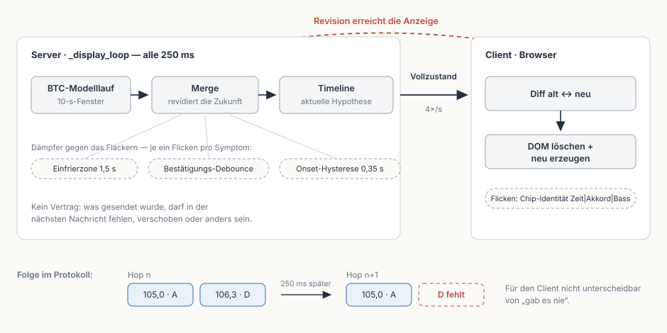
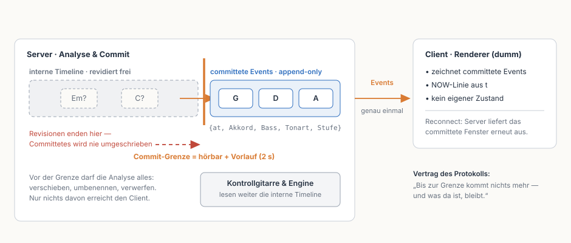
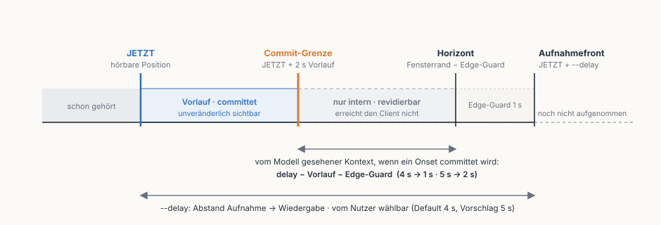

# Zeitleisten-Redesign: Commit-Grenze im Server, dummer Client

Stand: 2026-08-27 · Status: **Alle vier Migrationsschritte umgesetzt.**
index.html liest den Publish-once-Kanal, `--delay 5` ist Default, die
Anzeige-Daempfer sind zurueckgebaut (die Commit-Grenze hat die Einfrierzone
ersetzt). /timeline-poc bleibt als interne Debug-Oberflaeche bestehen.

Baut auf der Analyse
[zeitleiste-stabilitaet-analyse.md](zeitleiste-stabilitaet-analyse.md) und dem
Client-PoC (`/timeline-poc`) auf. Der PoC hat das Publish-once-Prinzip erlebbar
gemacht; dieses Dokument zieht daraus die Architektur-Konsequenz und verschiebt
die Logik dorthin, wo sie hingehoert: in den Server.

> **Entscheidung in einem Satz:** Die Analyse darf innerhalb ihres Fensters
> beliebig revidieren — aber was die Commit-Grenze passiert, wird **genau
> einmal** als Event ausgeliefert und nie wieder angefasst. Der Client zeigt
> nur noch an.

Zustaendigkeiten danach, ohne Ausnahme:

| Zustaendigkeit | Ort |
|---|---|
| Analysieren, Revidieren, Stabilisieren, Committen | **Server** |
| Committete Events zeichnen, NOW-Linie bewegen | **Client** |


## 1. Das Problem heute: Event-Form, Schnappschuss-Semantik

Der heutige `/events`-Feed sieht aus wie eine Ereignisliste
(`{at: 105.0, c: "A", b: …}`), ist aber keine: Jede Nachricht ersetzt den
kompletten Zustand, 4×/s ([cli.py:821](../jampilot/cli.py#L821)). Es gibt
keinen Vertrag, dass ein einmal gesendeter Eintrag in der naechsten Nachricht
noch existiert — er darf fehlen, verschoben oder umbenannt sein. Der Client
kann „wurde revidiert" nicht von „gab es nie" unterscheiden; er rendert die
Differenz, und die UI flackert.



Ein Eintrag kann zwischen zwei Hops aus vier Quellen verschwinden oder seine
Identitaet wechseln:

1. **Zukunfts-Revision:** `_merge_model_segments`
   ([cli.py:748](../jampilot/cli.py#L748)) baut alles jenseits der
   Einfrierzone pro Hop neu auf.
2. **Rueckwirkende Kurzsegment-Fusion** unter der Mindestlaenge
   (`MIN_SEGMENT_SECONDS`, [btc.py](../jampilot/btc.py)).
3. **Grenzverschiebung** durch `refine_boundary`
   ([cli.py:763](../jampilot/cli.py#L763)) — die UI schluesselt Chips ueber
   `Zeit|Akkord|Bass`, eine verschobene Grenze ist fuer sie loeschen + neu.
4. **Bass-Neubemessung** pro Hop ueber das jeweils aktuelle Segmentintervall
   (`_bass_per_segment`, [cli.py:805](../jampilot/cli.py#L805)).

Weil die Grundsemantik „darf jederzeit alles umschreiben" blieb, wurde jedes
Symptom einzeln gedaempft: Einfrierzone (`BTC_FREEZE_AHEAD`,
[cli.py:49](../jampilot/cli.py#L49)), Bestaetigungs-Debounce
(`previous_segments`, [cli.py:688](../jampilot/cli.py#L688)), Onset-Hysterese
(`ONSET_HYSTERESIS`, [cli.py:42](../jampilot/cli.py#L42)), Chip-Identitaets-
Heuristik im Client — und zuletzt der PoC mit Slice-Raster und eigener
Uhr-Synchronisation als weiterer Flicken auf Client-Seite. Fuenf Mechanismen an
vier Orten, und der D-A-D-Verschluck-Bug (behoben in 394ff38) hat gezeigt, wie
leicht sie sich gegenseitig auf die Fuesse treten.


## 2. SOLL: eine Grenze statt fuenf Daempfer



*Lesart: Datenfluss von links nach rechts — Eintraege wandern aus der Analyse
ueber die Grenze zum Client. Dieselbe Grenze in Stream-Zeit zeigt die Grafik
in Abschnitt 3.*

Vier Regeln, mehr nicht:

1. **Vor dem Commit gehoert alles der Analyse.** Verschieben, umbenennen,
   verwerfen — erlaubt und erwuenscht. Nichts davon verlaesst den Server.
2. **Am Uebertritt wird committet.** Rutscht ein Timeline-Eintrag unter
   `hoerbar + Vorlauf`, wird er genau einmal als Event emittiert. In diesem
   Moment werden alle sichtbaren Attribute eingefroren: Onset (exakt, kein
   Raster), Akkordname, Bass, Tonart-Schreibweise, Nashville-Stufe.
3. **Committetes ist unantastbar.** Kein Update, kein Loeschen, kein
   Nachschieben vor die Grenze. Der Vertrag des Protokolls lautet: „Bis zur
   Grenze kommt nichts mehr — und was da ist, bleibt."
4. **Der Client ist dumm.** Er zeichnet Events und bewegt die NOW-Linie aus
   `t`. Kein Diff, keine Identitaets-Heuristik, keine eigene Uhrlogik ueber
   die NOW-Interpolation hinaus.

Protokollskizze (append-only statt Vollzustand):

```json
{
  "t": 105.2,
  "frontier": 107.3,
  "new_events": [
    {"at": 107.05, "c": "A", "b": "C#", "acc": "sharp", "degree": "5"}
  ],
  "muted": false
}
```

`frontier` macht explizit, was heute implizit und falsch beantwortet wird:
die Frage, wann die Abwesenheit eines Wechsels endgueltig ist. Bei
Verbindungsabbruch liefert der Server beim Subscribe das komplette committete
Fenster erneut aus — der Last-State-Mechanismus in `_serve_events`
([web.py:173](../jampilot/web.py#L173)) haelt dafuer statt einer Nachricht die
Event-Historie des Anzeigefensters vor. Kontrollgitarre und Engine lesen
weiterhin die interne, revidierbare Timeline — fuers Anschlagen zaehlt die
beste aktuelle Hypothese, fuers Lesen die stabile Fassung.


## 3. Timing: ein einziger Regler



Die Qualitaet der committeten Events haengt daran, wie viel Kontext das
Modell **nach** einem Onset gesehen hat, wenn dieser committet wird — und der
sichtbare Vorlauf daran, wie weit die Commit-Grenze vor NOW liegt. Beides
speist sich aus demselben Puffer; seit dem Umbau teilt er sich **haelftig**
(`_commit_ahead()` in cli.py):

    Vorlauf = Verstehzeit = (--delay − Edge-Guard) / 2

| `--delay` | Vorlauf (Laufband) | Verstehzeit nach Onset |
|---|---|---|
| 3 s | 1 s | 1 s |
| **5 s (Default)** | **2 s** | **2 s — der gemessene Arbeitspunkt** |
| 6 s | 2,5 s | 2,5 s |
| 8 s | 3,5 s | 3,5 s |

Urspruenglich war der Vorlauf fix (2 s) und jede weitere Puffersekunde floss
komplett in die Verstehzeit. Die Messung in Abschnitt 5 zeigt aber, dass
deren Nutzen ab ~2 s abflacht (1,8 → 1,2 → 0,9 pt) — zusaetzliche Sekunden
sind als sichtbarer Vorlauf besser angelegt. Mit der haelftigen Teilung tut
`--delay 6` genau das, was man intuitiv erwartet: mehr Laufband UND bessere
Events. Der Client braucht dafuer nichts zu wissen — er liest den Vorlauf aus
`frontier − t`.

Der Puffer von 5 s ist kein Beinbruch — JamPilot spielt ohnehin verzoegert.
Die Deutung ist neu: **der Nutzer steuert mit dem Puffer Vorlauf und
Analysequalitaet zugleich.** Das gehoert so benannt in die Einstellungen
(z. B. „Analysepuffer"), statt als technischer Latenzwert versteckt zu sein.


## 4. Warum das Redesign einfacher, stabiler, verlaesslicher ist

**Einfacher — es faellt mehr weg, als hinzukommt:**

| Mechanismus heute | Ort | im SOLL |
|---|---|---|
| Einfrierzone `BTC_FREEZE_AHEAD` | Server-Merge | entfaellt — die Commit-Grenze *ist* die Einfrierzone |
| Bestaetigungs-Debounce fuer die Anzeige | Server-Merge | entfaellt als Anzeige-Schutz; intern optional |
| Onset-Hysterese gegen Chip-Springen | Server | nur noch intern vor dem Commit relevant |
| Chip-Identitaet `Zeit\|Akkord\|Bass` + Delete/Recreate-Daempfung | Client | entfaellt — ein Event ist eine stabile Identitaet |
| Slice-Raster + Uhr-Synchronisation | PoC-Client | entfaellt — der Server kennt seine Zeit selbst |
| Vollzustands-Diff pro Nachricht | Client | entfaellt — append-only |

Hinzu kommt genau ein Mechanismus: die Commit-Grenze mit Event-Emission —
wenige Zeilen in der Hop-Schleife, alle Eingaben (`audible_pos`, Timeline,
Bass, Tonart) liegen dort schon vor.

**Stabiler:** Publish-once ist keine Daempfung mehr, sondern eine Garantie.
Ein gezeigter Akkord, ein Slash-Bass, eine Nashville-Zahl koennen nicht mehr
verschwinden — strukturell nicht. Onsets bleiben dabei exakt (die
23-ms-Verfeinerung wird mit committet, kein 250-ms-Raster), und committete
Segmente koennen nicht wie im PoC zwischen Abtastpunkten durchfallen.

**Verlaesslicher:** Der Vertrag ist explizit statt implizit. Reconnect ist
deterministisch (committetes Fenster erneut ausliefern, fertig). Und alle
Anzeigen — Web, Terminal, kuenftige Clients — lesen dieselbe eine Lesefassung
statt eigener Interpretationen desselben Hypothesenstroms.


## 5. Der Preis und die offenen Entscheidungen

Ehrlich benannt: **Spaete Erkenntnis ist verloren.** Revidiert das Modell einen
Bereich, nachdem er committet wurde, sieht der Spieler die alte Fassung. Das
ist dieselbe Fehlerklasse wie der D-A-D-Bug — nur diesmal als bewusste
Produktentscheidung statt als Versehen, und kalibrierbar ueber die
Verstehzeit.

### Messergebnis: Der Preis ist klein (2026-08-27)

Gemessen am Referenz-Set ([tests/reference](../../tests/reference/README.md),
5 Tracks, Isophonics-Ground-Truth, 1822 Messpunkte im 0,5-s-Raster):
simuliertes 10-s-Gleitfenster, verglichen wird das Frame-Label beim Einfrieren
(Fensterende `T + 1 s Edge-Guard + v`) mit dem Endurteil (Fensterende `T + 5 s`,
das letzte Urteil vor Hoerbarkeit) und mit der Ground Truth (Root-Ebene).

| Verstehzeit v | entspricht | revidierte Frames (Root) | Acc eingefroren | Acc final | Verlust | Verlust abseits von Wechseln |
|---|---|---|---|---|---|---|
| 0 s | `--delay 3` | 7,4 % | 84,5 % | 84,5 % | ±0,0 pt | 0,3 pt |
| 1 s | `--delay 4` | 7,6 % | 82,7 % | 84,5 % | 1,8 pt | 1,4 pt |
| **2 s** | **`--delay 5`** | 6,3 % | 83,3 % | 84,5 % | **1,2 pt** | **0,5 pt** |
| 3 s | `--delay 6` | 4,4 % | 83,5 % | 84,5 % | 0,9 pt | 0,3 pt |

Drei Befunde:

1. **Der Wahrheitsverlust ist klein — die Revisionen sind es nicht.** Bei
   Verstehzeit 2 s werden noch ~6 % der Frames nach dem Commit revidiert,
   aber netto bringt das nur ~1 Punkt Root-Accuracy: Die Revisionen
   korrigieren fast so oft, wie sie verschlimmbessern. Bei *its_too_late*
   verlieren sie sogar netto (eingefroren 91,3 % vs. final 89,0 %). Die
   heutige Architektur bezahlt also dauerhaftes UI-Flackern fuer rund einen
   Prozentpunkt spaete Korrektur.
2. **Die Haelfte des Restverlusts ist Grenz-Jitter.** Abseits von ±250 ms um
   annotierte Wechsel bleiben bei Verstehzeit 2 s nur 0,5 Punkte — die
   Wechsel*erkennung* aendert sich kaum noch, nur die Grenz*platzierung*
   wackelt, und die wird beim Commit ohnehin von `refine_boundary` gesetzt.
3. **Der Ausreisser bestaetigt die Genre-Grenze, nicht das Einfrieren:**
   *crazy_little_thing* verliert 4 Punkte (77,4 % vs. 81,4 %) bei 14 %
   revidierten Frames — der stilistisch wackligste Track. Aber auch sein
   Endurteil liegt nur bei 81 %: Das Problem ist die Modellunsicherheit
   selbst, nicht der Commit-Zeitpunkt.

**Damit ist die Kernfrage des Messplans beantwortet: `--delay 5`
(Verstehzeit 2 s) kostet ~0,5–1 Punkt Root-Accuracy gegenueber ewigem
Revidieren — und kauft dafuer die strukturelle Publish-once-Garantie.**
Messskript: [tests/reference/messung_einfrieren.py](../../tests/reference/messung_einfrieren.py).

### Live-Befund vom Revisions-Zaehler (2026-08-27, Migrationsschritt 2)

Erster Realaudio-Lauf mit dem umgesetzten Commit-Kanal (Dire-Straits-Track,
Live-Pfad, Zaehler der PoC-Seite; ein Event zaehlt pro Kategorie einmal):

| | `--delay 4` | `--delay 5` |
|---|---|---|
| Namenswechsel | 7 | 4 |
| Grenze > 150 ms | 1 | 0 |
| Bass leer→Ton (kam nach) | 17 | 7 |
| Bass Ton→leer (zurueckgenommen) | 24 | 19 |
| Bass Ton→Ton (gewechselt) | 0 | 1 |
| Event verschwunden | 0 | 0 |
| betroffene Events | 19 % | 12 % |
| **Vertragsverletzungen** | **0** | **0** |

Das bestaetigt die Referenz-Messung auf der echten Merge-Timeline:
Akkordnamen und Grenzen sind nach dem Commit fast stabil, der Kanal haelt
seine Garantie — die dominante Restquelle ist der Bass. Der Delay-Vergleich
trennt dabei zwei Ursachen: Das *Nachruecken* (17→7) ist ein
Poolinglaengen-Problem und schrumpft mit `--delay 5`; die *Ruecknahmen*
(24→19) nehmen die Huerden auch mit 2 s Pooling und erodieren erst spaeter —
gegen sie hilft nicht mehr Laenge, sondern Persistenz (siehe Bass-Regel).

**Nachmessung gegen die Bass-Ground-Truth (2026-08-27):** Der Verdacht, die
Bass-*Erkennung* selbst sei instabil, hat sich nicht bestaetigt. Gegen die
Isophonics-Bass-Annotationen (412 Segmente ≥ 1 s) urteilt `slash_note` bei
2 s Pooling identisch zum vollen Segment — 1 % falsche Slashes, 41 %
Umkehrungs-Recall, nur 5 von 412 Urteilen kippen ueberhaupt zwischen den
Poolingstufen. Instabil war die **Kopplung ans bewegliche Segmentintervall**:
Verschiebt sich das Intervallende (naechster Onset, Analysefront), kippt die
Mehrheit — nicht die Messung selbst. Konsequenz (umgesetzt): Der Bass wird
ueber ein **festes Fenster [Onset, Onset + 2 s]** gepoolt
(`BASS_POOL_SECONDS`); sobald es voll ist, ist das Urteil per Konstruktion
final. Die Persistenz (`BASS_COMMIT_HOPS`) sichert die Wachstumsphase, das
einmalige Nachruecken (`b_up`) den Rest. Messskript:
[tests/reference/messung_bass_gt.py](../../tests/reference/messung_bass_gt.py).

Offen zu entscheiden, jeweils klein:

- **Bass-Regel (entschieden und umgesetzt):** Ton→Ton kommt praktisch nicht
  vor — die Bassmessung wechselt nie die Note, sie gewinnt oder verliert nur
  ihre Sicherheit. Daraus folgt eine **monotone Regel** aus drei Teilen:
  (1) Gepoolt wird ueber ein festes Fenster [Onset, Onset + 2 s] statt bis
  zum beweglichen Segmentende (`BASS_POOL_SECONDS` — beseitigt die
  Wurzelursache der Ruecknahmen, siehe Nachmessung oben). (2) Beim Commit
  wird ein Bass nur behauptet, wenn dieselbe Note ueber die letzten Hops
  (~1 s, `BASS_COMMIT_HOPS`) stabil gemessen war. (3) Danach darf leer genau
  einmal auf gesetzt nachruecken (`b_up`), nie zurueck. Ein Slash erscheint
  damit hoechstens einmal und verschwindet nie; Akkordname und Position
  bleiben strikt publish-once.
- **Stille und Unsicherheit:** Echte Stille (`-`) ist ein Event; „kein
  zuverlaessiger Akkord" (`?`) erzeugt keins — das letzte Event gilt weiter.
  Das ist die alte Template-Semantik, jetzt als Commit-Regel.
- **Mehrdeutige Passagen:** In grundtonlosen Parts ist die wechselnde
  Erkennung gewollt (Improvisationshilfe). Sie bleibt erhalten — Folge-Events
  duerfen weiter wechseln — aber jeder Wechsel steht dann fest. Ob sich das
  dort besser anfuehlt als heutiges Flackern, entscheidet der Playtest mit
  genau diesen Stuecken.


## 6. Migrationspfad (alle Schritte umgesetzt, 2026-08-27)

1. ✅ **Zweiter Broadcast-Kanal** (`frontier` + `committed`) neben dem
   Vollzustand; `index.html` blieb zunaechst unberuehrt.
2. ✅ **PoC-Seite auf den neuen Kanal umgestellt** — dummer Renderer plus
   Revisions-Zaehler und Vertragspruefung (Live-Laeufe: 0 Verletzungen).
3. ✅ **Playtest + Messung:** `--delay 5` ist Default (Verstehzeit 2 s);
   Bass-Regel per Ground-Truth- und Live-Messung entschieden.
4. ✅ **`index.html` umgestellt:** liest ausschliesslich `committed` +
   `frontier`; Chips haben Event-Identitaet (kein Delete/Recreate, nur das
   einmalige Bass-Nachruecken zeichnet einen Chip nach). Die Einfrierzone
   (`BTC_FREEZE_AHEAD`) ist entfernt — die Commit-Grenze schuetzt Merge und
   Nachverfeinerung; Bestaetigungs-Debounce und Onset-Hysterese bleiben als
   **Commit-Qualitaets-Waechter** (Ein-Hop-Launen und Rasterwandern sollen
   es nie in ein Event schaffen). Der `chords`-Vollzustand bleibt als
   Debug-Kanal fuer /timeline-poc im Feed; die Felder `lead` und `v`
   (Safe-Voicings, stillgelegt) sind aus dem Protokoll entfernt.


## Nicht-Ziele

Modellqualitaet (maj7-Bias, Genre-Sensitivitaet), Tonart-Erkennung und der
stillgelegte Template-Pfad bleiben unberuehrt. Dieses Redesign aendert nicht,
*was* erkannt wird — nur, *wann es unumstoesslich wird und wer das
entscheidet.*
